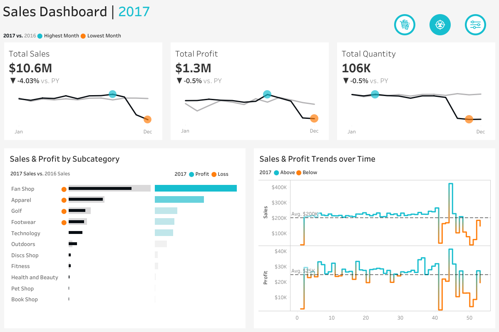

# 🌟 Blackrock Sales Dashboard: Uncovering Data-Driven Growth 🌟

## 🚀 Project Story
_Blackrock, a global leader in Home Décor & Gift products, wanted to know what really drives their revenue—and where the next big opportunity lies. As their data consultant, I transformed 530,000 rows of retail transactions into actionable insights and a compelling dashboard for the C-suite._

## 📊 Dashboard at a Glance

> **Explore the full interactive experience:**  
> [🔗 View on Tableau Public](https://public.tableau.com/app/profile/derek.sado8467/viz/BlackrockAnalysis_17556950423180/Dashboard1?publish=yes)

---

## 🎯 Business Questions Answered

- **How seasonal is our revenue, and what does it mean for next year’s strategy?**
- **Which countries and customers truly fuel our growth (besides the UK)?**
- **Where should Blackrock focus its expansion efforts?**

---

## 🗂️ Data Snapshot

- **Rows:** 530,000 transactions
- **Columns:** 9 features (see table below)
- **Period:** January 2010 – December 2011
- **Format:** Excel (.xlsx)

| Field        | What It Tells Us |
|--------------|-----------------|
| InvoiceNo    | Order basket, shopping journey |
| StockCode    | Product ID, inventory flow |
| Description  | Product name, customer taste |
| Quantity     | Units bought, demand trend |
| InvoiceDate  | Timing, seasonality |
| UnitPrice    | Pricing, margin |
| CustomerID   | Loyalty, segments |
| Country      | Market, region focus |
| Revenue      | Quantity × Unit Price |

---

## 💡 Insights Unlocked

- **📈 Q4 Magic:** November is the blockbuster month ($1.51M). Q4 alone = 33.6% of annual revenue. But watch out: December drops 58%—classic post-holiday blues.
- **🌍 Europe is the Engine:** Netherlands and EIRE lead non-UK sales; Australia is our star outside Europe. Top 4 Euro markets deliver 61.5% of international revenue.
- **👑 Power Customers Rule:** Top 10 customers = 16.1% of annual sales. Customer 14646 alone brings in 4x more than the 10th-ranked customer—prime candidates for VIP programs.
- **🗺️ Expansion Potential:** Demand is clustered in Western/Northern Europe & Australia. Asia, Africa, and Russia remain untapped.

---

## 🔮 Recommendations (From Data to Action)

- **Supercharge Q4:** Invest in inventory, marketing, and logistics for the holiday rush.  
- **Q1 Comeback:** Launch post-holiday campaigns to fight the February slump.
- **Double Down on Europe:** Grow market share where the brand already wins.
- **VIP Customer Care:** Retain and grow big accounts with tailored strategies.
- **Explore New Markets:** Use winning playbooks to enter North America and nurture rising stars in Spain, Japan, and beyond.

---

## 🛠️ How To Explore

1. **Open the Tableau dashboard** (`tableau/sales_dashboard.twbx`) for a deep dive.
2. **Check out the Excel data** in `data/` to follow the analysis journey.
3. **Browse images/** for quick visual summaries.

---

## 🙋‍♂️ Let’s Connect

For questions, ideas, or collaborations, reach out via [GitHub](https://github.com/didiavanti).

---

> _Data isn’t just numbers—it’s the story behind Blackrock’s success. This dashboard is your map to what comes next._
