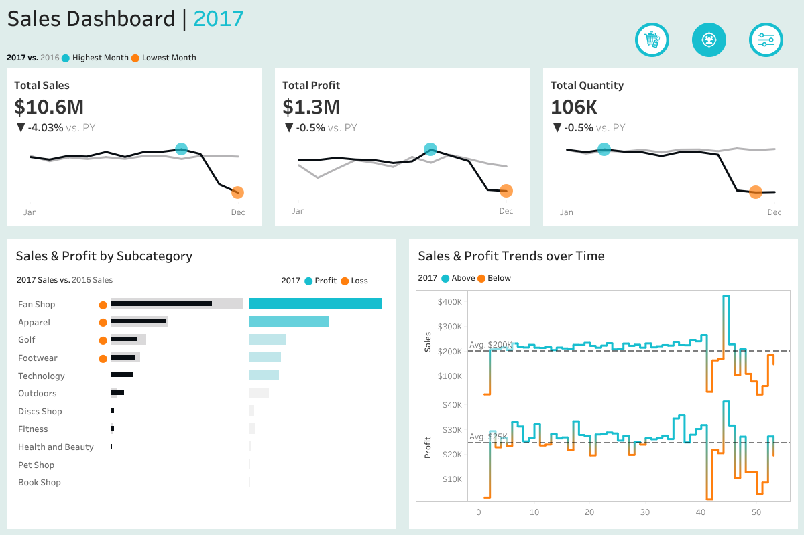
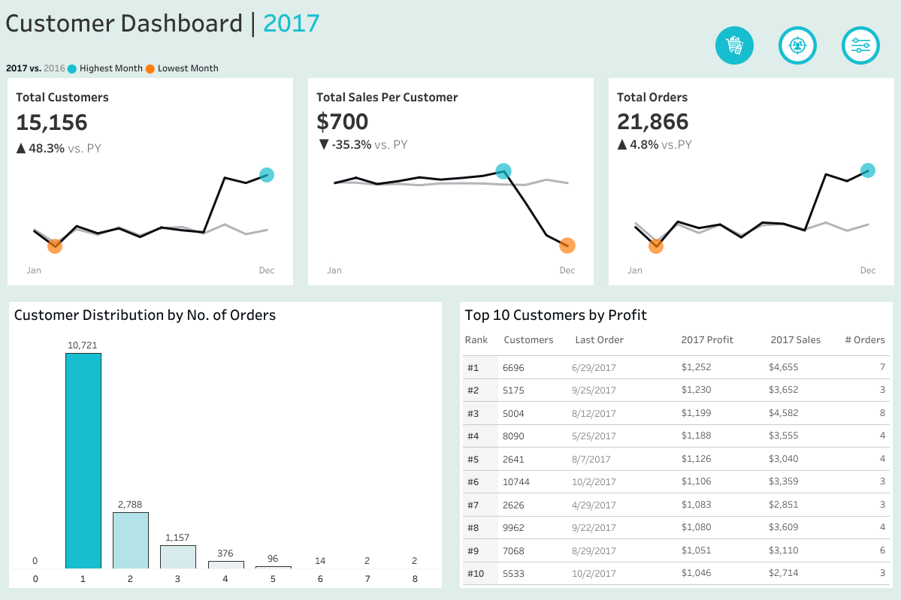

# 🎲 Gamescube: Uncovering Insights with Business Intelligence Dashboards

---

## 🚩 The Challenge

> *"How can we turn our data into decisions?"*

In 2017, **Gamescube**—a leading retailer of sports merchandise, apparel, technology, and recreational products—found itself at a crossroads. Years of rapid growth had generated a massive trove of transactional and customer data. Yet, much of this goldmine sat unused, and strategic decisions became harder as sales plateaued, profit margins shrank, and customer loyalty waned.

Despite onboarding **15,000+ active buyers** and maintaining over **$10M in annual sales**, the company faced tough questions:
- Why was average spend per customer falling?
- Why did nearly 3 out of 4 customers never return?
- What hidden strengths and weaknesses lay buried in the product mix and regions?

---

## 💡 My Approach

I was brought in to **transform raw data into a strategic asset**. My mission: design and deliver two interactive dashboards—**Sales** and **Customer**—that would uncover patterns, highlight opportunities, and empower smarter decisions.

### 1️⃣ Understanding the Landscape

- **Data Structure:**  
  Mapped the database (Orders, Customers, Geo Lookup, Order Status) with over **180,000 records**.
- **Initial Data Work:**  
  Performed rigorous quality checks and transformations using Excel.

  #### 📦 Gamescube Data Schema

This schema describes the structure of the main dataset used for the Gamescube Business Intelligence Dashboards. It covers key columns, their data types, and descriptions to clarify their role in analysis.

| Column Name             | Data Type  | Description                                                                                  |
|------------------------ |-----------|----------------------------------------------------------------------------------------------|
| Subcategory             | String    | Product subcategory (e.g., Sporting Goods).                                                  |
| Customer Id             | Integer   | Unique identifier for each customer.                                                         |
| Customer Segment        | String    | Type of customer (e.g., Consumer, Corporate, Home Office).                                   |
| Category                | String    | High-level product category (e.g., Fitness).                                                 |
| Latitude                | Float     | Latitude coordinate of customer's location.                                                  |
| Longitude               | Float     | Longitude coordinate of customer's location.                                                 |
| City                    | String    | City where the order was placed.                                                             |
| Country                 | String    | Country where the customer is located.                                                       |
| Order Date              | DateTime  | Date and time when the order was placed (format: DD/MM/YYYY HH:MM).                          |
| Order Id                | Integer   | Unique identifier for the order.                                                             |
| Quantity                | Integer   | Number of units purchased in the order.                                                      |
| Sales                   | Float     | Sales value of the order.                                                                    |
| Order Profit Per Order  | Float     | Profit (or loss if negative) from the order.                                                 |
| Region                  | String    | Geographic region of the customer (e.g., South Asia, Southeast Asia).                        |

---

> *For additional details on data models or to request sample data files, please reach out or explore the repository further!*

  

### 2️⃣ Shaping the Story

I collaborated with executives and sales managers to identify key business questions:

- _How are sales and profits trending over time?_
- _Which product subcategories and regions drive growth or losses?_
- _How loyal are our customers, and who drives the most value?_
- _Where do we have the greatest opportunities for retention and growth?_

---

### 3️⃣ Building the Dashboards

Using **Tableau**, I created two interactive dashboards:

#### 📊 Sales Dashboard

Visualizes:
- Year-over-year and month-to-month sales, profits, order volumes
- Category and subcategory performance
- Regional comparisons

*Figure 1: Sales Dashboard. Trends and product mix are visualized for fast executive insights.*

#### 👥 Customer Dashboard

Highlights:
- Customer segmentation by order frequency and spend
- Top performers and at-risk segments
- Geographic filters for targeted analysis

*Figure 2: Customer Dashboard. Explore loyalty, value, and retention patterns by region.*

---

## 🔍 The Insights

The dashboards told a compelling story:

- **Stable but Declining Performance:**  
  2017 sales hit **$10.6M** (-4% YoY); profit fell to **$1.3M** (-6.5% YoY).

- **Customer Growth vs. Value:**  
  Customer base soared **+48%**, but average spend dropped **-35%** to **$700** per customer.

- **Retention Challenges:**  
  **71%** of customers placed only one order.

- **Concentrated Value:**  
  Top 10 customers delivered over **$11K in profit**.

- **Product & Regional Patterns:**  
  _Fan Shop_ led revenue, _Technology_ & _Outdoors_ excelled in profitability; other categories and regions lagged.

---

## 📈 The Impact

With these insights, Gamescube’s leadership gained clarity—and a roadmap for action:

- **Customer Retention:**  
  Initiatives to convert one-time buyers into repeat customers.
- **Profit Margin Recovery:**  
  Deep dives into cost drivers and pricing.
- **Seasonality:**  
  Targeted strategies for weak months like December.
- **Product Mix Optimization:**  
  Focus on winners, re-evaluate underperformers.

The dashboards became central to Gamescube’s strategy sessions, driving conversations and tactical choices. This project demonstrated how **data storytelling** and visualization can unlock business potential.

---

## 🛠️ Tools Used

- **Tableau:** Interactive dashboards
- **Excel:** Data cleaning, querying, and transformation

---

## 🔗 Explore More

- [Download Full Dashboards](https://public.tableau.com/app/profile/derek.sado8467/viz/GamescubeSalesDashboard/SalesDashboard)
- [Access Supporting Excel Files](https://onedrive.live.com/personal/17a8772dab2dbf70/_layouts/15/doc.aspx?resid=749e2ea5-d30a-4568-bc73-c63ca5519aba&cid=17a8772dab2dbf70)

---

**Ready for your review!**  
If you’d like to see more dashboard screenshots, data models, or code samples, just let me know.
